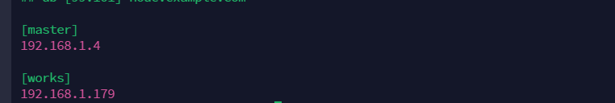

# ansible自动化部署k3s

#### 介绍
项目只是单点master集群，而且develop分支是在线部署，需要网络通畅，不然会发生下载中断。

#### 软件架构
ansible+docker+k3s+wireguard

#### 安装教程

1）下载好ansible
1.  yum install -y epel-release
2.  yum install -y ansible

#### 使用说明

1.在ansible目录的hosts填写自己的master和work主机的ip（/etc/ansible/hosts）
如：
2.注意机器要互通
3.ssh.sh脚本是分发服务器密钥，把master和works节点都要填写进去，可写在一个txt里面。

#### 注意项目
只支持centos7系统或者欧拉/龙溪